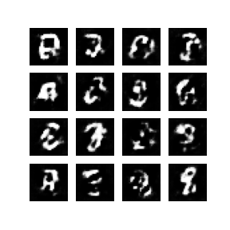

# Facial Image Generation with Generative Adversarial Networks
by Manuel Herold and Alexander Lercher

## Training Data
Various [sources](training_images/readme.md) were used as real input for the Discriminator.

## Results
### DCGAN

### HR-DCGAN

## Reports
[Alexander Lercher's report](reports/lercher/report_lercher.ipynb) is a Jupyter Notebook about GAN theory and the DCGAN and HR-DCGAN implementation.