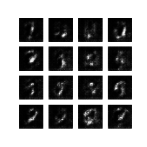

# Facial Image Generation with Generative Adversarial Networks
by Manuel Herold and Alexander Lercher

## Training Data
Various [sources](training_images/readme.md) were used as real input for the Discriminator.

## Results
### DCGAN

### HR-DCGAN

## Additional Sources for Report

- [explanation of transposed convolution _Conv2DTranspose_ to apply for generator (increase image size)](https://towardsdatascience.com/types-of-convolutions-in-deep-learning-717013397f4d)